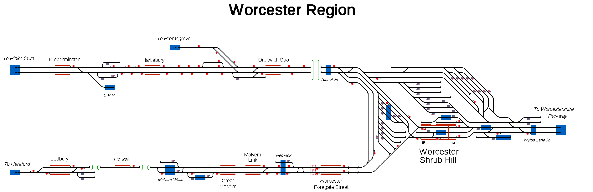

# Worcester Region

Simulation of Worcester, Kidderminster and Malvern area in the UK, including Midland and GWR services, set in Spring 2025.

## Current Status

| Stage         | Status        |
| ------------- |:-------------:|
| Track Plan     | :heavy_check_mark: |
| Signalling      | :heavy_check_mark:      |
| Naming | :heavy_check_mark:      |
| Speed Limits | :x: |
| Distances | :x: |
| Timetable | :x: |
| Documentation | :x: |

## Data Sources

- [Raildar](https://raildar.co.uk/)
- [OpenTrainTimes](https://www.opentraintimes.com/)
- [Traksy](https://traksy.uk/live)
- [Map Meurisse](https://map.meurisse.org/)
